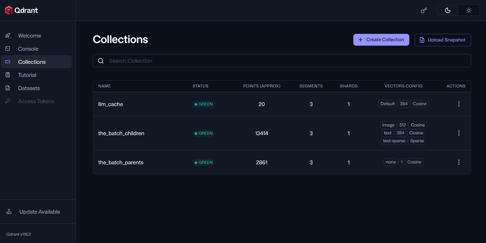

# The Batch RAG: Project Approach and Design Documentation
### Table of Contents
1. **Introduction**

2. **System Architecture**

3. **Methodology: Ingestion & Retrieval**

4. **Model Selection & Rationale**

5. **The Audit Framework**

6. **Behavioral Analysis & Metric-Driven Refinement**

7. **Hardware Optimization Strategy (GTX 1050 Ti)**

8. **Conclusion & Future Work**
9. **Class and methods documentation** 
10. **Qdrant Collections**


### 1. Introduction
The Batch RAG is a production-grade Multimodal Retrieval-Augmented Generation (RAG) system designed to process, 
synthesize, and evaluate complex data from The Batch AI newsletter. The system addresses the "Trust Gap" in local AI by integrating an autonomous judge that audits every response for factual groundedness and hallucinations across 11 distinct metrics.

### 2. System Architecture
The system is built on a containerized microservices architecture to ensure resource isolation and scalability.API Engine: A FastAPI server handling WebSocket-based streaming and RAG logic.Vector Database: Qdrant, used for high-dimensional similarity searches of text and image metadata.Inference Layer: Ollama, orchestrating local LLMs (Qwen 2.5 and Llama/Moondream).Monitoring Hub: A Streamlit dashboard that visualizes audit scores and database health.
### 3. Methodology: Ingestion & Retrieval
- 3.1. Multimodal Data IngestionThe ingestion pipeline uses langchain-text-splitters to chunk newsletter text while maintaining rigid links to visual assets stored in the data/ directory. This ensures that retrieval results are "holistic"—providing the LLM with both textual context and raw image paths for visual reasoning.
- 3.2. Retrieval MechanicsWe utilize Cosine Similarity for vector matching within Qdrant. To optimize for local VRAM, the system retrieves a maximum of $k=3$ chunks per query, ensuring the context window remains efficient for the 1.5B/3B parameter models used.4. Model Selection & RationaleQwen 2.5 (1.5B/3B): Chosen for its exceptional reasoning-to-size ratio, fitting comfortably within 4GB VRAM.Moondream/Llama-Vision: Utilized for the multimodal integration requirement to "describe" and "connect" retrieved images to the user's query.Qdrant: Selected for its "StatefulSet" reliability and ease of persistence via Docker volumes.

### 5. The Audit Framework
Every response is automatically critiqued by an internal "Judge LLM" across four frameworks:

| Framework    | Key Metrics | Objective|
| --------- | ----------- | ----------- |
| Ragas    | Faithfulness, Relevancy       |Detects groundedness in retrieved context.
| FactCC | Logical Consistency        | BERT-based check for factual contradictions.
|NER | NER Recall/Precision | Flags entities (companies, dates) the LLM "invented".
|RAI| Toxicity, Bias, Safety| Ensures the system maintains safety guardrails.

### 6. Behavioral Analysis & Metric-Driven Refinement
The system adapts its behavior based on these metrics:Self-Correction: If the Faithfulness score drops below $0.7$, the system triggers a Refinement Loop, re-prompting the LLM to ground its answer more strictly in the provided text.Drift Detection: By monitoring average scores weekly, RAG can detect "Semantic Drift," signaling when new newsletter topics require updated prompt templates.


### 7. Hardware Optimization Strategy (GTX 1050 Ti)
To run these complex tasks on a 4GB VRAM card, several optimizations were implemented:

- Process Reaping: Used ```init: true``` in Docker to immediately clear zombie Python processes.

- Sequential Inference: The Auditor and the Generator are managed via semaphores to ensure they never attempt to use the GPU at the same time.

- Environment Sync: develop: watch was used to hot-reload code without the memory-intensive process of rebuilding Docker images during development.

### 8. Conclusion & Future Work
The Batch RAG successfully demonstrates that a high-fidelity, multimodal RAG system can be deployed on consumer hardware without sacrificing evaluation rigor. Future iterations will focus on Kubernetes-based CronJobs for fully automated weekly updates and enhanced Image-to-Vector similarity search.

# 9.Class and methods documentation
Table of Contents
- ```Data Processing (mapping.py)```
- ```RAG Engine (rag_engine.py)```
- ```API(api.py)```
- ```Autonomous Evaluator (evaluator.py)```
- ```Metrics Database (metrics_db.py)```
- ```Docker files: Dockerfile, docker_compose.yml, .dockerignore```

### Data Processing (mapping.py)
This class handles the transformation of raw "The Batch" newsletters into searchable vector embeddings.

```class DataIngestor
__init__(self, qdrant_host: str, qdrant_port: int)
```
Initializes the connection to the Qdrant vector database using environment variables.

```
init_db(self, collection_name: str)
```
Checks for the existence of a collection; deletes and recreates it to ensure a fresh index for new batches.

```
split_documents(self, documents: List[Document])
```
Uses RecursiveCharacterTextSplitter from langchain_text_splitters to break text into 600-token chunks with a 50-token overlap.

```
process_images(self, image_path: str)
```
Extracts metadata from visual assets and generates descriptive tags using a local Vision-Language Model (VLM).

```
scrape_and_ingest(self)
```
Orchestrates the full pipeline: downloading content, splitting text, processing images, and pushing the final "Context Packs" to Qdrant.

# RAG Engine (rag_engine.py)
The core logic responsible for retrieval, synthesis, and the self-correction loop.
```
class MultimodalRAG 
__init__(self, model_name: str)
```
- Initializes asynchronous clients for Qdrant and Groq/Ollama.

- Sets up a Semaphore(1) to ensure only one heavy inference task runs at a time, protecting the 1050 Ti from OOM crashes.
```
run_hybrid_rag(self, query_str, ...)
 ```
- Semantic Cache: Checks the llm_cache collection for similar previous queries before proceeding.

- Hybrid Search: Performs a multi-vector search using dense text, sparse BM25, and image vectors via Qdrant's Fusion Query (RRF).

- Small-to-Big Expansion: Retrieves child snippets but feeds the full "Parent" text to the LLM to provide maximum context.
```
describe_image(self, image_b64, related_titles)
 ```
Sends retrieved visual assets to a Vision-Language Model (VLM) to generate a 15-word technical description for the context window.
```
refine_answer(self, initial_answer: str, audit_scores: dict)
 ```
If audit scores (e.g., Faithfulness) fall below 0.7, this method re-prompts the LLM to correct errors based on the audit feedback.

# Evaluator (metrics.py)
The RAG Auditor class provides the "Judge LLM" logic to ensure output quality.

class Evaluator
```
__init__(self, embeddings, llm)
```
Initializes the evaluation environment by wrapping LangChain components into Ragas-compatible objects.

- judge_llm: A LangchainLLMWrapper around the local LLM (e.g., Qwen 2.5 or Llama 3) used as the "Internal Auditor."

- embeddings: A LangchainEmbeddingsWrapper used for calculating vector-based metrics like Answer Relevancy.

- faithfulness: Ragas metric to detect hallucinations by checking if claims are supported by the context.

- answer_relevancy: Ragas metric to ensure the answer addresses the specific user prompt.

- context_utilization: Ragas metric to measure how much of the retrieved information was actually used.

```
async check_response(self, question, answer, contexts)
```
The primary orchestration method. It takes a live query, the generated answer, and the retrieved context chunks to produce a comprehensive Safety & Quality Report.

- Converts inputs into a Dataset object.

- Triggers aevaluate (Async Ragas) for deep semantic scoring.

- Runs FactCC, RAI Harm, InterpretEval, and NLP stats in a sequential/asynchronous pipeline.

- Consolidates all data into a single dictionary for database logging.

```
async _calculate_nlp_stats(self, reference, candidate)
```
Calculates traditional NLP metrics to establish a baseline for text similarity.

- Metric - ROUGE-L: Measures the longest common subsequence to determine how much text was "summarized" directly from the context.

- Metric - BLEU: Uses a smoothing function to measure linguistic overlap.

```
async evaluate_rai_harm(self, answer)
```
Framework: Microsoft RAI
Prompts the Judge LLM to act as a safety filter. It analyzes the text for Hate Speech, Violence, Self-harm, and Sexual content, returning a harm_score (0.0 to 1.0).

```
async evaluate_factcc(self, context, answer)
```
Framework: Salesforce FactCC
Mimics a BERT-based factual consistency classifier.
Logic: It instructs the LLM to specifically look for Entity Swaps (e.g., swapping "Google" for "OpenAI") and Numerical Errors that standard RAG often misses.

```
async calculate_interpret_eval_ner(self, context, answer)
```
A Named Entity Recognition (NER) analysis.

- ner_coverage: Ratio of context entities successfully mentioned in the answer (Recall).

- ner_hallucination: Ratio of entities in the answer that do not exist in the context (Out-of-Vocabulary/Hallucination).

- ner_density: Frequency of entities relative to total word count.

# Metrics Db (metrics_DB.py)
Stored all metrics in SQLite DB

# API (api.py)
```
async def lifespan(app: FastAPI)
```
The lifespan context manager handles the "startup" and "shutdown" events of the server.

- Startup: Initializes the global gpu_semaphore within the active event loop to ensure thread-safe resource locking.

- Shutdown: Triggers engine.close() to gracefully terminate asynchronous connections to Qdrant and Ollama, preventing "loop closed" errors.

```
async def websocket_endpoint(websocket: WebSocket)
```
The primary entry point for the Streamlit UI. It manages a persistent two-way connection.

- Input: JSON containing the query and the search mode (Hybrid, Text, or Visual).

- Gatekeeper: Immediately rejects queries with a confidence score below 0.2 to save compute resources.

Multi-Stage Response:
- Answer: Streams or pushes the final generated text, pushes the headline, source URLs, and image descriptions first to reduce perceived latency.
- Audit: Triggers a background task for evaluation.

```
async def audit_and_push_correction(...)
```
This method runs as a "Fire and Forget" asyncio.task.

- Evaluation: Calls the Evaluator class to grade the answer while the user is already reading it.

- Threshold Logic: If the faithfulness score is < 0.7, it assumes a hallucination has occurred.

- Refinement: Triggers engine.refine_answer() and pushes a "Correction" type message to the WebSocket.

- Logging: Sends the final cleaned metrics to the Monitoring DB.

```
def clean_ragas_scores(raw_scores: dict)
```
A utility function that prepares Ragas output for the SQLite database.

- Validation: Maps Ragas scores to the mandatory 17-column schema.

- Safety: Catches NaN or Inf values using math.isnan() and converts them to 0.0. This prevents "Dirty Data" from breaking the historical trend lines on the dashboard.

# Prompt templates(prompt_templates.py)
Collections of prompt used for RAG system.

# UI Templpates (UI_templates.html)
UI for user interface.

# Metrics Dashboard
Dashboard for metrics tracking via Streamlit

# 10. Qdrant 

Qdrant has 3 collections: batch_children for search, parents_batch as storage, llm_cache is cache collections, where all answear stored to not run RAG several times for the same questions.


